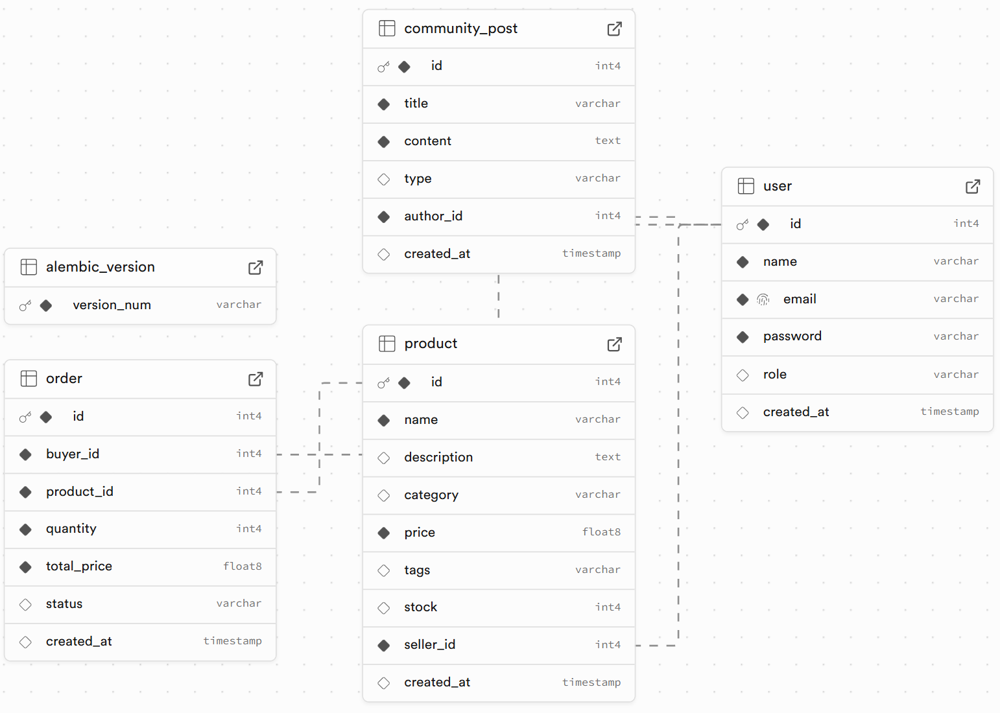

# ♻️ ReCircle API

**ReCircle** is a web-based API platform designed to support eco-friendly communities by enabling users to trade recyclable products, manage orders, and participate in environmental discussions. Built using Flask and Flask-RESTX, this RESTful API is powered by PostgreSQL (hosted on Supabase), uses JWT for authentication, and provides a clean Swagger interface for developers.

## 🌍 Features

- ✅ User Registration & JWT Authentication
- 📦 Product Listings (CRUD for sellers)
- 📬 Order Placement & Management
- 🗣️ Community Posts (like a forum)
- 📊 Swagger documentation for all endpoints
- 🐳 Dockerized for easy deployment
- ☁️ Deployment-ready with Koyeb

---

## 📌 Technologies Used

- **Flask** with **Flask-RESTX** (API + Swagger)
- **PostgreSQL** (hosted on **Supabase**)
- **Flask-JWT-Extended** (Authentication)
- **Alembic** (Database Migrations)
- **Docker & Docker Compose**
- **Koyeb** (Cloud Hosting)

---

## 📂 Project Structure

```
ReCircle_Backend/
│
├── app/
│   ├── models/ (SQLAlchemy models: user, product, order, community_post)
│   │   ├── __init__.py
│   │   ├── user.py
│   │   ├── product.py
│   │   ├── order.py
│   │   └── community_post.py
│   ├── routes/ (Flask route namespaces: users, products, orders, community)
│   │   ├── __init__.py
│   │   ├── users.py
│   │   ├── products.py
│   │   ├── orders.py
│   │   └── community.py
│   ├── utils/ (Utility functions)
│   │   ├── __init__.py
│   │   ├── auth.py
│   │   └── supabase_client.py
│   ├── config.py (Configuration variables and classes)
│   ├── database.py (DB session and engine initialization)
│   └── __init__.py (App factory setup)
├── migrations/
│   └── ... (alembic revision files)
├── main.py (App entry point)
├── Dockerfile (Build instructions)
├── docker-compose.yml (Docker multi-service definition)
├── alembic.ini (Alembic configuration file)
├── .env (Environment variables - not committed)
└── requirements.txt (Python dependencies)

```

## 🚀 Getting Started

Clone the Repository

```
git https://github.com/anggreinipra/ReCircle_backend.git
cd ReCircle_backend
```

## 🔐 Environment Variables

Create a .env file in the root directory with the following keys:

```
env

FLASK_ENV=development
DATABASE_URL=postgresql://<your-supabase-credentials>
JWT_SECRET_KEY=your_jwt_secret
You can get your DATABASE_URL from the Supabase Project → Settings → Database.
```

## 🔑 Authentication

- Use /api/users/register to create an account
- Use /api/users/login to retrieve your JWT
- Attach the JWT as Bearer < token > in the Authorization header for all protected routes

## 📦 Dockerfile (Simplified)

```
dockerfile

FROM python:3.11-slim-bullseye

WORKDIR /app

COPY requirements.txt .
RUN pip install --no-cache-dir -r requirements.txt

COPY . .

CMD ["./docker-entrypoint.sh"]
```

## 🧩 docker-compose.yml

```
yaml

version: "3.8"

services:
  web:
    build: .
    ports:
      - "5000:5000"
    env_file:
      - .env
    volumes:
      - .:/app
```

## 🧪 Run Locally with Docker

Build and Run with Docker Compose

```
docker-compose up --build
```

This will:

- Build your Flask app
- Run database migrations using Alembic
- Serve the API on http://localhost:5000

## 🛠️ Supabase Setup (PostgreSQL Hosting)

1. Go to https://supabase.com and create a project.
2. Copy your database credentials.
3. Use those in your .env as DATABASE_URL.
4. Optionally connect pgAdmin or use Supabase SQL Editor to inspect tables.

## ⚙️ Alembic for Migrations

To create or upgrade database schema:

```
docker-compose exec web alembic revision --autogenerate -m "initial"
docker-compose exec web alembic upgrade head
```

In Supabase, you can also use the GUI to view your tables and data. Also, you can generate schema diagrams to visualize your database structure.


## ☁️ Deploying to Koyeb

1. Push your project to GitHub.
2. Go to https://www.koyeb.com.
3. Create a new app → Select Docker → Connect GitHub.
4. Use the following build and run command:
5. Build Command: docker build -t recircle .
6. Run Command: ./docker-entrypoint.sh
7. Set environment variables on Koyeb (same as .env)
8. Koyeb will auto-deploy on every push!

## 📚 API Documentation (Swagger UI)

After the app is running, navigate to:

http://localhost:5000/docs

## API Endpoints

### 👤 User Management

| Method | Endpoint        | Description                                  |
| ------ | --------------- | -------------------------------------------- |
| POST   | /users/register | Register a new user                          |
| POST   | /users/login    | Login with email & password to get JWT token |
| GET    | /users/me       | Get current user profile                     |

### 📦 Product Management

| Method | Endpoint       | Description                 |
| ------ | -------------- | --------------------------- |
| GET    | /products      | List all products           |
| POST   | /products      | Create a new product        |
| GET    | /products/<id> | Get product by ID           |
| PUT    | /products/<id> | Update product (owner only) |
| DELETE | /products/<id> | Delete product (owner only) |

### 🛒 Order Management

| Method | Endpoint     | Description                      |
| ------ | ------------ | -------------------------------- |
| POST   | /orders      | Create a new order               |
| GET    | /orders      | List all orders for current user |
| GET    | /orders/<id> | Get order by ID                  |
| PUT    | /orders/<id> | Update order (seller only)       |
| DELETE | /orders/<id> | Delete order (seller only)       |

### 🗣️ Community Posts

| Method | Endpoint              | Description                 |
| ------ | --------------------- | --------------------------- |
| GET    | /community/posts      | List all community posts    |
| POST   | /community/posts      | Create a new community post |
| GET    | /community/posts/<id> | Get community post by ID    |
| PUT    | /community/posts/<id> | Update community post       |
| DELETE | /community/posts/<id> | Delete community post       |

## 📄 License

This project was developed as part of the RevoU FSSE Assignment Individual Test for Group Project by [@anggreinipra](https://www.linkedin.com/in/anggreinipra/).

---

© 2025 ReCircle API. All Rights Reserved.
